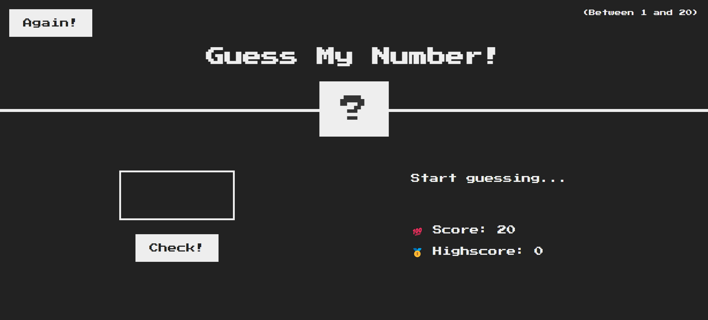

# Guess My Number

A fun and simple number guessing game built with JavaScript, HTML, and CSS. The objective of the game is to guess a randomly generated number between 1 and 20.



## Table of Contents

- [Demo](#demo)
- [Features](#features)
- [Installation](#installation)
- [Usage](#usage)

## Demo

Check out the live demo of the game [here](https://hananeaitbenyachou.github.io/Guess-My-Number/).

## Features

- Randomly generated secret number between 1 and 20.
- Simple and intuitive user interface.
- Score tracking and high score saving.
- Feedback messages guiding the player ("Too high!", "Too low!", "Correct Number!").

## Installation

To run the game locally, follow these steps:

1. **Clone the repository:**

    ```bash
    git clone https://github.com/HananeAitBenYachou/Guess-My-Number.git
    ```

2. **Navigate to the project directory:**

    ```bash
    cd Guess-My-Number
    ```

3. **Open `index.html` in your preferred web browser.**

## Usage

- Enter a number between 1 and 20 in the input field.
- Click the "Check" button to make a guess.
- The game will provide feedback if the guess is too high, too low, or correct.
- The score decreases with each incorrect guess.
- If you guess the correct number, the game will highlight your success, and you can restart the game by clicking the "Again" button.
